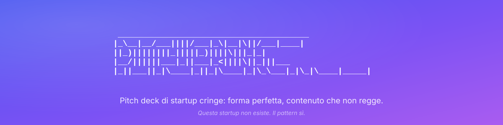

# PitchCringe

Una skill per Claude Code che genera **pitch deck di startup cringe** in formato
[Marp](https://marp.app/) (markdown, una slide per sezione). Il deck riproduce
l'imbarazzo autentico delle startup in cerca di soldi: forma perfetta, contenuto
che non regge, e una voce che non strizza mai l'occhio.

Companion di *linkedin-cringe*: stessa tassonomia, stessi paletti, formato diverso.

## Cosa fa

- Genera pitch deck completi (copertina, problema, soluzione, mercato, business
  model, traction, competizione, team, proiezioni, ask) pronti da renderizzare
  con Marp in PDF o HTML, con il tema grafico della casa già nel frontmatter
  (titoli Space Grotesk, lead su gradiente, sfondi con glow tenui).
- Calibra il risultato su:
  - **Livello di cringe** da 1 a 10 (default 7);
  - **Registro**: credibile, parodico o surreale deadpan;
  - **Fase**: pre-seed, seed, Serie A;
  - **Voce del founder**: ex consulente, tech-bro, primo pitch, imprenditore
    tradizionale;
  - **Moduli cringe** scelti da un catalogo di 36 (TAM a tre cerchi, "siamo
    l'Uber di X", grafico che sale, valutazione assurda, ecc.).
- Applica le regole fisse della casa, a ogni livello e in ogni registro:
  - la matrice della competizione include sempre un **competitor assurdo**
    ("i nonni", "alzare la voce"), trattato con la stessa serietà degli altri;
  - le persone hanno sempre **doppio nome e doppio cognome, col secondo nome
    ottocentesco** ("Maria Clotilde Colombo Brambilla") e referenze incredibili
    ma non verificabili;
  - le **proiezioni coprono cinque anni**, il quinto sovrastimato oltre ogni
    logica, con un **grafico SVG costruito sui dati** nella stessa slide,
    senza unità sull'asse Y;
  - ogni **immagine vive in una slide dedicata** con un titolo da manifesto, e
    deve sembrare una foto vera, mai un render patinato.
- Se c'è l'estensione Claude in Chrome, **genera le immagini** su Gemini col tuo
  account (nessuna API key) e le inserisce nel deck; altrimenti consegna i
  prompt pronti.
- Dopo il deck genera anche il **post LinkedIn del founder** con la skill
  *linkedin-cringe*, passandole numeri, origin story ed eufemismi del pitch.
- Italiano di default, ma funziona in qualunque lingua.
- Chiude sempre con una slide di disclaimer che rivela lo scherzo (rimovibile),
  con il link a questo repository.

## Paletti

Nessuna startup, persona, azienda, fondo o programma reale: tutto è inventato e
non googlabile. Email e domini usano il TLD riservato `.example`. Niente loghi,
niente notizie tragiche come gancio. I dettagli sono in
`.claude/skills/pitch-cringe/SKILL.md`, sezione "Paletti".

## Installazione

La skill vive in `.claude/skills/pitch-cringe/`, il percorso standard delle
skill di progetto di Claude Code.

### Claude Code (skill di progetto)

Clona il repository e apri Claude Code al suo interno: la skill è subito
disponibile.

```bash
git clone https://github.com/matteobaccan/PitchCringe.git
cd PitchCringe
```

### Claude Code (skill personale, disponibile in ogni progetto)

Copia la cartella della skill nella directory delle skill personali:

```bash
cp -r PitchCringe/.claude/skills/pitch-cringe ~/.claude/skills/pitch-cringe
```

Su Windows (PowerShell):

```powershell
Copy-Item -Recurse PitchCringe\.claude\skills\pitch-cringe "$env:USERPROFILE\.claude\skills\pitch-cringe"
```

In entrambi i casi la skill si attiva da sola quando chiedi un pitch deck,
oppure esplicitamente con `/pitch-cringe`.

### Claude.ai / Claude Desktop

Comprimi il contenuto di `.claude/skills/pitch-cringe/` (la cartella con
`SKILL.md` e `references/`) in uno zip e caricalo in
*Settings → Capabilities → Skills*.

## Uso

Esempi di richieste:

- "Fammi un pitch deck cringe per una startup di pastiglie profuma-ambiente"
- "Il deck dell'Uber dei dog sitter, livello 9, voce tech-bro"
- "Un pitch surreale deadpan, inventa tu l'idea"
- "Pitch deck in inglese, registro credibile, fase pre-seed"

Se non specifichi i parametri, la skill li chiede (o usa i default: livello 7,
registro credibile, seed, voce ex consulente).

Ogni deck finisce in `esempi/<nome-startup>/`, insieme al post LinkedIn e alle
immagini. La cartella è in `.gitignore`: i deck generati restano locali.

Per renderizzare un deck (il flag `--allow-local-files` serve per le immagini):

```bash
npx @marp-team/marp-cli esempi/nomestartup/pitch-nomestartup.md --allow-local-files -o pitch-nomestartup.pdf
```

oppure usa il plugin Marp per VS Code. Se Claude ha una shell con marp-cli, il
PDF lo genera e lo controlla da solo.

## Immagini

I deck nascono con le immagini descritte fra parentesi quadre. Per averle
davvero, il modo più semplice è l'estensione
[Claude in Chrome](https://claude.com/chrome): Claude apre Gemini nel tuo
browser col tuo account Google (nessuna API key), genera le foto dai prompt
della skill, le scarica in `img/` accanto al deck e le inserisce in slide
dedicate. Basta chiederglielo ("genera le immagini del deck"). Il grafico delle
proiezioni invece non si genera: è un SVG scritto sui dati della tabella.

## Struttura del repository

```
assets/
  banner.svg                   # Il banner di questo README
.claude/skills/pitch-cringe/
  SKILL.md                     # La skill: flusso, regole fisse, paletti
  references/
    tassonomia.md              # Definizione operativa, scala 1-10, registri
    moduli.md                  # Catalogo dei 36 moduli cringe (P01-P36)
    lessico.md                 # Fabbrica di nomi, buzzword, formule, disclaimer
    struttura-marp.md          # Scheletro del deck, tema della casa, regole Marp
    surreale.md                # Regole del registro surreale deadpan
    esempi.md                  # Deck ed estratti calibrati per livello
CLAUDE.md                      # Convenzioni del repo per Claude Code
esempi/                        # Deck generati, uno per sottocartella (in .gitignore)
  <nome-startup>/
    pitch-<nome-startup>.md    # Il deck
    post-<nome-startup>.md     # Il post LinkedIn companion
    img/                       # Immagini generate e SVG delle proiezioni
```

## Licenza

[MIT](LICENSE) — © 2026 Matteo Baccan.

Le startup generate non esistono. Il pattern sì.
